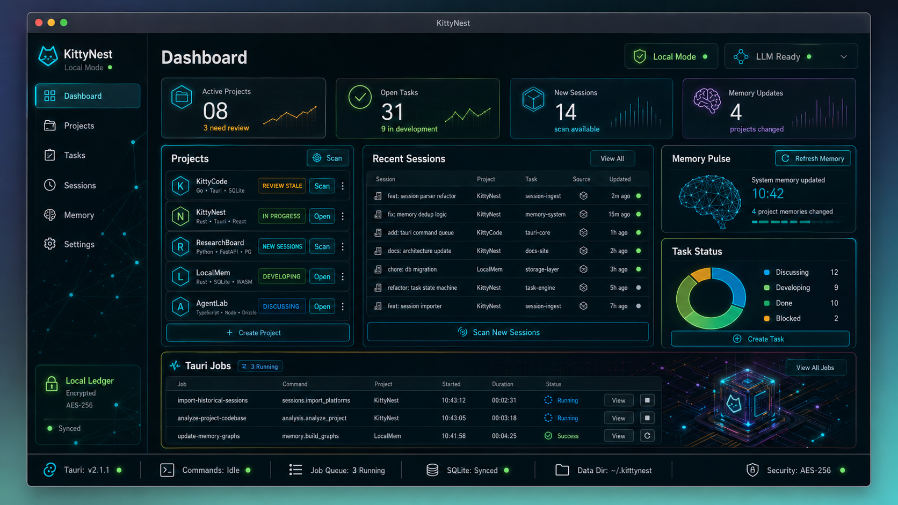

# KittyNest

<p align="center">
  
</p>

<p align="center">
  <strong>Local-first memory tracker for Claude Code & Codex</strong>
</p>

<p align="center">
  <a href="README_ZH.md">简体中文</a>
</p>

---

KittyNest is a **local-first, privacy-centric macOS desktop application** that helps you track, organize, and make sense of your AI coding sessions from [Claude Code](https://docs.anthropic.com/en/docs/agents-and-tools/claude-code/overview) and [Codex](https://openai.com/index/openai-codex/). All your data stays on your machine — sessions are indexed locally in SQLite, and insights are stored as readable Markdown files.

## ✨ Features

- **🔍 Session Discovery** — Automatically scan and import sessions from Claude Code (`~/.claude`) and Codex (`~/.codex`)
- **📁 Project Tracking** — Group sessions by working directory, review project health, and generate project summaries
- **📝 Task Management** — Organize sessions into tasks with statuses (Discussing → Developing → Done)
- **🧠 Memory System** — Three-tier cascading memory (Session → Project → System) with entity-relationship graph
- **🤖 LLM-Powered Analysis** — Analyze sessions and projects using your own API keys (OpenAI-compatible, Anthropic-compatible, and more)
- **📊 Dashboard** — At-a-glance view of active projects, open tasks, recent sessions, and memory status
- **🔒 Local-First & Private** — All data stored in `~/.kittynest`; nothing leaves your machine unless you explicitly send it to your configured LLM provider

## 🏗️ Architecture

```
┌─────────────────────────────────────────────────────────────┐
│  React Frontend (Vite + TypeScript)                         │
│  Dashboard · Projects · Tasks · Sessions · Memories · Settings│
└──────────────────────┬──────────────────────────────────────┘
                       │ invoke
┌──────────────────────▼──────────────────────────────────────┐
│  Tauri 2 Shell                                              │
│  macOS Window · Menu · File System Permissions · Lifecycle  │
└──────────────────────┬──────────────────────────────────────┘
                       │
┌──────────────────────▼──────────────────────────────────────┐
│  Rust Backend                                               │
│  Commands · Adapters · Jobs · LLM Client · Markdown Store   │
└──────────────────────┬──────────────────────────────────────┘
        ┌──────────────┴──────────────┐
        ▼                             ▼
┌───────────────┐           ┌─────────────────────┐
│  SQLite Index │           │  Markdown Store     │
│  (local cache)│           │  ~/.kittynest/      │
└───────────────┘           └─────────────────────┘
```

## 🚀 Getting Started

### Prerequisites

- [Node.js](https://nodejs.org/) 18+
- [Rust](https://www.rust-lang.org/tools/install) 1.70+
- macOS (primary target platform)

### Development

```bash
# Install frontend dependencies
npm install

# Run in development mode (opens Tauri window)
npm run tauri dev
```

### Build

```bash
# Build production bundle (.app and .dmg)
npm run tauri build
```

The build artifacts will be located in `src-tauri/target/release/bundle/`.

## 📂 Data Storage

All application data is stored locally under `~/.kittynest/`:

```
~/.kittynest/
├── config.toml              # LLM provider settings
├── kittynest.sqlite         # SQLite index database
├── kittynest_graph.db       # Entity-relationship graph database
├── projects/
│   └── <project_slug>/
│       ├── info.md          # Project summary
│       ├── progress.md      # Project progress
│       └── <task_slug>/
│           ├── summary.md
│           ├── user_prompt.md
│           └── <session>.md
└── memories/
    ├── sessions/
    │   └── <session_slug>/
    │       └── memory.md
    ├── projects/
    │   └── <project_name>.md
    └── system/
        └── memory.md
```

## ⚙️ Supported LLM Providers

KittyNest supports a wide range of LLM providers via presets:

- OpenRouter
- DeepSeek
- Zhipu GLM
- Bailian
- Kimi (Moonshot)
- StepFun
- MiniMax
- DouBao (Seed)
- ModelScope
- Ollama (local)
- OpenAI-compatible APIs

You can configure your provider in the **Settings** page.

## 🛠️ Tech Stack

| Layer | Technology |
|-------|------------|
| Frontend | React 18, TypeScript, Vite |
| Desktop Shell | Tauri 2 |
| Backend | Rust |
| Database | SQLite (rusqlite) |
| Graph DB | CozoDB (SQLite-backed) / Pure SQLite fallback |
| UI Components | Lucide React, XYFlow |
| Styling | Custom CSS |

## 🗺️ Roadmap

- [x] Project skeleton & configuration
- [x] Claude Code / Codex source adapters
- [x] Project tracking & manual review
- [x] Historical session batch analysis
- [x] Incremental session scanning
- [x] Memory module (Session / Project / System)
- [x] Task creation & management
- [x] Settings page & LLM configuration
- [x] macOS desktop integration
- [ ] Graph query UI
- [ ] Memory versioning & rollback
- [ ] Auto-updater
- [ ] Apple Silicon optimization

## 🤝 Contributing

Contributions are welcome! Please feel free to submit issues or pull requests.

## 📄 License

[MIT](LICENSE)

---

<p align="center">
  Built with ❤️ for local-first AI session management
</p>
