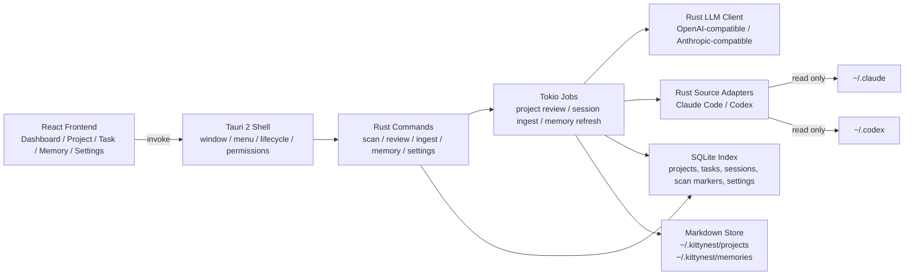

# KittyNest 开发计划

> 基于 `prompt.md`，日期：2026-04-26

## 1. 明确假设

- KittyNest 是一个本地优先的 macOS 桌面应用，默认运行在用户自己的电脑上。
- 桌面应用使用 React 前端和 Tauri 2 桌面壳；开发调试时使用 Vite dev server，生产环境加载打包后的静态前端资源。
- Claude Code 和 Codex 的 session/config 目录只读扫描；KittyNest 只写入 `~/.kittynest`。
- `~/.kittynest/projects` 和 `~/.kittynest/memories` 下的 Markdown 文件是长期可读产物；SQLite 只做索引、去重、任务状态和扫描进度缓存。
- 项目名、任务名、session 名使用英文 slug 作为文件路径；页面标题、摘要、说明可以使用中文。
- LLM 调用会把必要的代码摘要、session 摘要或用户提示发送给用户配置的 provider；UI 需要明确显示这类动作是手动触发还是自动触发。
- macOS 首版按 Developer ID 分发的非沙盒应用设计，用于读取用户主目录下的 Claude Code、Codex 和项目目录。
- MVP 不做云同步、多用户权限、远程 Agent 控制、Mac App Store 分发，也不直接修改 Claude Code 或 Codex 的原始数据。

## 2. 成功标准

- 能从本机 Claude Code 和 Codex 的默认数据目录发现项目与 session，并按 `workdir` 归属到项目。
- 用户能手动触发项目代码 review，生成 `info.md`。
- 用户能批量导入历史 session，生成项目、任务、session 三层 Markdown 摘要，并更新 `progress.md`。
- 用户能扫描新增 session，系统只处理未入库记录，并把它们归入已有任务或创建新任务。
- 用户能在桌面应用中创建任务、追加提示词、切换任务状态。
- 项目级记忆和系统级记忆能在对应流程中更新。
- LLM provider 设置支持 KittyCode 中的 preset 风格：provider、base_url、interface。
- 用户能安装并启动 macOS `.app`，通过原生窗口使用 KittyNest；关闭窗口时后台分析任务能被明确取消或继续运行。
- 打包产物包含应用图标、基础菜单、日志位置、首次启动初始化，以及后续 notarization 所需的签名配置预留。

## 3. 推荐技术路线

### 推荐方案：React + Vite + Tauri 2 + Rust Commands + SQLite + Markdown

这是更适合 KittyNest 的桌面应用路线。React/Vite 负责前端界面和交互状态；Tauri 2 负责 macOS 窗口、菜单、文件系统权限、打包、签名和应用生命周期；Rust commands 负责读取 Claude Code/Codex 数据、写入 SQLite/Markdown、调用 LLM provider。前后端边界清晰，不需要额外维护本地 HTTP 服务进程。

### 备选方案

- Tauri + FastAPI sidecar：能复用 Python 生态，但会引入 Rust、React、Python、端口、本地服务进程和 sidecar 打包，首版复杂度偏高。
- Electron + Node 后端：桌面生态成熟，但体积较大，且本地文件权限、安全边界和打包体验不如 Tauri 克制。
- FastAPI + pywebview：Python 开发快，但前端体验、原生集成、签名分发和长期维护不如 Tauri 标准化。

结论：直接采用 React + Tauri 2 的前后端分离桌面架构。除非后续出现 Rust 实现成本明显过高的能力，再考虑把特定分析能力拆成 sidecar；MVP 不引入 FastAPI sidecar。

## 4. 系统架构



macOS 桌面壳职责：

- 加载 React 静态资源并提供 Tauri WebView 窗口。
- 管理应用生命周期：启动、关闭、后台任务确认、日志入口。
- 提供基础菜单：About KittyNest、Settings、Open Data Folder、Quit。
- 配置 Tauri capabilities，只暴露必要的文件系统、shell、opener 和日志能力。
- 后续预留自动更新、签名、notarization 和崩溃日志能力。

前后端接口原则：

- 前端只通过 `invoke` 调用 Tauri commands，不直接读写 `~/.kittynest`。
- Rust commands 返回结构化 DTO，前端负责展示和交互状态。
- 长任务通过 job id、事件推送和轮询状态结合实现，避免阻塞 UI。
- LLM provider 的 api key 只保存在本地配置或系统钥匙串引用中，不写入前端状态持久化。

## 5. 本地数据契约

```text
~/.kittynest/
  config.toml
  kittynest.sqlite
  projects/
    <project_name>/
      info.md
      progress.md
      <task_name>/
        summary.md
        <session_name>.md
        user_prompt_<id>.md
  memories/
    <project_name>.md
    memory.md
```

SQLite 建议保存：

- `projects`：project slug、workdir、来源、最后 review 时间。
- `tasks`：task slug、project slug、状态、summary 文件路径、更新时间。
- `sessions`：session id、来源、workdir、task slug、摘要文件路径、原始修改时间、处理状态。
- `user_prompts`：prompt id、task slug、文件路径、创建时间。
- `settings`：provider、base_url、interface、model、api key 引用方式。

Markdown 文件建议使用 frontmatter，保存 slug、来源、更新时间、关联 session id、任务状态等机器可读字段，正文保存给人看的摘要。

## 6. LLM 输出契约

所有 LLM 分析先输出结构化 JSON，再由系统渲染成 Markdown。这样可以减少文件格式漂移。

### 项目 review 输出

- `project_name`：英文 slug。
- `display_title`：页面显示标题。
- `summary`：项目目标和当前状态。
- `tech_stack`：主要语言、框架、工具。
- `architecture`：核心模块和数据流。
- `code_quality`：可维护性、测试、复杂度观察。
- `risks`：潜在风险点。

### 任务归纳输出

- `task_name`：英文 slug。
- `title`：任务标题。
- `brief`：任务简介。
- `session_ids`：归属该任务的 session id 列表。
- `status_hint`：讨论中、开发中、已完成之一；用户仍可在 UI 覆盖。

### Session 摘要输出

- `session_name`：英文 slug。
- `title`：session 标题。
- `summary`：用户目标、助手动作、结果、后续风险。
- `task_name`：归属任务 slug。

### 记忆输出

- 项目级记忆：偏好、约束、长期决策、项目事实。
- 系统级记忆：跨项目重复点合并，冲突点显式解决，不保留互相矛盾的原句。

## 7. 开发里程碑

### 阶段 0：项目骨架与配置

目标：建立可运行的 React + Tauri 应用骨架。

- 创建 React + Vite + TypeScript 前端工程。
- 创建 Tauri 2 工程和 Rust command 入口。
- 建立 `~/.kittynest` 初始化逻辑。
- 建立 SQLite schema migration。
- 移植 KittyCode provider preset：DeepSeek、Zhipu GLM、Bailian、Kimi、StepFun、Minimax、DouBaoSeed、ModelScope、OpenRouter、Ollama 等。
- 验证：`npm run tauri dev` 能打开 macOS 窗口；React 首页能调用 `get_app_state` command；首次启动能创建 `~/.kittynest/config.toml` 和数据库。

### 阶段 1：Claude Code / Codex 数据源适配器

目标：能只读发现项目和 session。

- 实现 `CodexSessionAdapter`，扫描 `~/.codex` 下可用的 session 索引和 session 文件。
- 实现 `ClaudeSessionAdapter`，扫描 `~/.claude/projects`、`~/.claude/sessions` 和历史记录中可用的会话数据。
- 统一输出 `RawSession`：source、session_id、workdir、created_at、updated_at、messages。
- 过滤消息，只保留 user 和 assistant 内容。
- 验证：用 fixture 覆盖 Codex、Claude 两种来源；同一个 session 重复扫描不会重复入库。

### 阶段 2：项目追踪与手动 review

目标：用户点击按钮后生成项目 `info.md`。

- 根据 session `workdir` 发现项目候选。
- UI 显示项目列表、来源、最近 session 时间、review 状态。
- 项目详情页提供“Review Project”按钮。
- 后端读取项目代码索引，控制输入规模后调用 LLM。
- 写入 `~/.kittynest/projects/<project_name>/info.md`。
- 验证：未点击按钮不会自动 review；点击后生成文件并更新 UI 状态。

### 阶段 3：历史 session 批量分析

目标：把存量 session 归纳为任务，并生成 session 摘要和项目进展。

- 批量读取所有未处理历史 session。
- 按 `workdir` 分组到项目。
- 对每个项目调用 LLM 归纳任务。
- 为每个任务写入 `summary.md`。
- 为每段 session 写入 `<session_name>.md`。
- 更新项目 `progress.md`。
- 验证：同一个 session 能归入一个任务；任务与 session 是一对多；重新运行不会重复生成同名 session 文件。

### 阶段 4：新增 session 增量扫描

目标：只处理新 session，并能更新已有任务。

- 保存每个来源的扫描 watermark 和已处理 session id。
- 扫描新增 session。
- 调用 LLM 判断归入已有任务还是创建新任务。
- 归入已有任务时，按需更新 `summary.md`。
- 创建新任务时，创建新目录和 `summary.md`。
- 更新 `progress.md`。
- 验证：新增 session 扫描连续运行两次，第二次应无新增处理。

### 阶段 5：记忆功能

目标：在项目 review、历史分析、增量分析时同步更新记忆。

- 项目级记忆写入 `~/.kittynest/memories/<project_name>.md`。
- 系统级记忆汇总所有项目级记忆，写入 `~/.kittynest/memories/memory.md`。
- UI 提供记忆页，显示更新时间、来源项目、关键条目。
- 验证：项目级记忆变化后，系统级记忆能合并重复点并消解冲突点。

### 阶段 6：用户创建和更新任务

目标：用户能在桌面应用中管理任务入口。

- 项目页提供“新建任务”表单。
- LLM 根据用户原始提示生成任务英文 slug 和简介。
- 保存原始提示到 `user_prompt_<id>.md`。
- 任务页支持追加提示词，追加后更新 `summary.md`。
- 任务页支持状态切换：讨论中、开发中、已完成。
- 验证：用户原始输入不会丢失；状态切换能同时更新 SQLite 和 Markdown frontmatter。

### 阶段 7：设置页与运行保护

目标：LLM 配置可用，并降低误操作风险。

- 设置页支持 provider preset、base_url、interface、model、api key 输入方式。
- 所有长任务显示执行状态、最近错误、重试按钮。
- 对发送给 LLM 的内容显示“将分析 session / 项目代码摘要”的确认提示。
- 验证：缺少 LLM 配置时，分析按钮显示不可执行原因；配置完整后按钮恢复。

### 阶段 8：macOS 桌面集成

目标：让 KittyNest 作为可安装的 macOS 桌面应用运行。

- 增加应用图标、窗口标题、默认窗口尺寸和最小窗口尺寸。
- 增加 Tauri 菜单：About、Settings、Open Data Folder、Open Logs、Quit。
- 关闭窗口时，如果有分析任务运行，提示用户选择继续后台运行或取消任务。
- 日志写入 `~/Library/Logs/KittyNest/kittynest.log`，用户数据仍写入 `~/.kittynest`。
- 首次启动检查 `~/.claude` 和 `~/.codex` 是否存在；不存在时在 UI 中显示“未发现来源”，不弹系统错误。
- 配置 Tauri capabilities：只允许访问 `~/.kittynest`、`~/.claude`、`~/.codex` 和用户显式选择的项目目录。
- 验证：双击桌面入口能打开窗口；菜单项能打开设置页和数据目录；关闭窗口行为符合运行中任务状态。

### 阶段 9：macOS 打包、签名与分发

目标：产出可安装、可验证的 macOS `.app` 和 `.dmg`。

- 使用 Tauri build 生成 `.app`，把 React 静态资源、Rust 二进制、图标和配置一起打包。
- 使用 Tauri bundler 生成 `.dmg`。
- 准备 Developer ID 签名配置和 notarization 脚本；本地开发可跳过签名。
- 产物命名为 `KittyNest-<version>-macos.dmg`。
- 验证：在干净 macOS 用户环境启动 `.app`，能创建 `~/.kittynest`，能打开 Dashboard，能读取存在的 Claude Code 和 Codex 数据目录。

## 8. UI 页面清单

- Dashboard：首页，展示项目、任务状态、最近 session、记忆更新时间。
- Projects：项目列表和项目详情。
- Project Detail：项目信息、进展、任务列表、Review Project、Scan Sessions。
- Task Detail：任务简介、状态切换、关联 session、追加提示词。
- Session Detail：session 标题、摘要、来源、归属任务。
- Memories：项目级记忆和系统级记忆。
- Settings：LLM provider 和扫描路径设置。
- macOS App Shell：Tauri 原生窗口、菜单、日志入口、数据目录入口。

## 9. 测试策略

- Adapter 测试：用脱敏 fixture 覆盖 Claude Code 和 Codex session 格式。
- Markdown 写入测试：验证路径、frontmatter、文件内容不会覆盖无关文件。
- LLM client 测试：mock provider，验证 prompt 输入和 JSON schema 解析。
- Pipeline 测试：历史导入、增量导入、任务归并、记忆更新。
- Frontend 测试：React 组件、状态流、表单校验和 Tauri command mock。
- Command 测试：Rust command DTO、错误映射、job 状态流和权限边界。
- Desktop smoke 测试：Tauri 窗口启动、菜单跳转、关闭窗口任务确认、日志文件写入。
- Packaging 测试：Tauri 产物包含 React 静态资源、图标、provider preset 和 capabilities；`.app` 在干净用户目录首次启动成功。

## 10. 主要风险与处理方式

- Session 格式变化：用 adapter 隔离来源格式，核心 pipeline 只依赖统一 `RawSession`。
- LLM 输出不稳定：先要求 JSON schema，再渲染 Markdown；解析失败进入可重试状态。
- 大项目 review 成本高：先生成代码文件索引和摘要，手动按钮触发，不自动全量读取。
- 隐私风险：UI 明确区分本地写入和发送给 LLM 的内容；默认不自动上传项目代码。
- 文件名冲突：slug 生成后检查同目录，冲突时追加短 hash。
- 重复扫描：SQLite 记录 session id、原始 mtime、输出文件路径，保证幂等。
- macOS 文件访问限制：首版不走 Mac App Store sandbox；对 `~/.claude`、`~/.codex` 和项目目录做只读扫描，并在 UI 中说明访问范围。
- Rust 实现速度低于 Python：优先实现窄接口和小模块；如果某个分析能力明显适合 Python，再单独评估 sidecar，不作为默认架构。
- Tauri command 权限过宽：按功能拆分 commands 和 capabilities，前端不能获得任意文件系统访问。
- 桌面壳和后台任务生命周期不一致：由 Tauri app state 管理任务，关闭窗口时根据任务状态决定退出、继续或取消。
- 打包遗漏静态资源或配置：把 Tauri bundle 配置纳入测试，启动 `.app` 后用 smoke test 检查关键页面资源。
