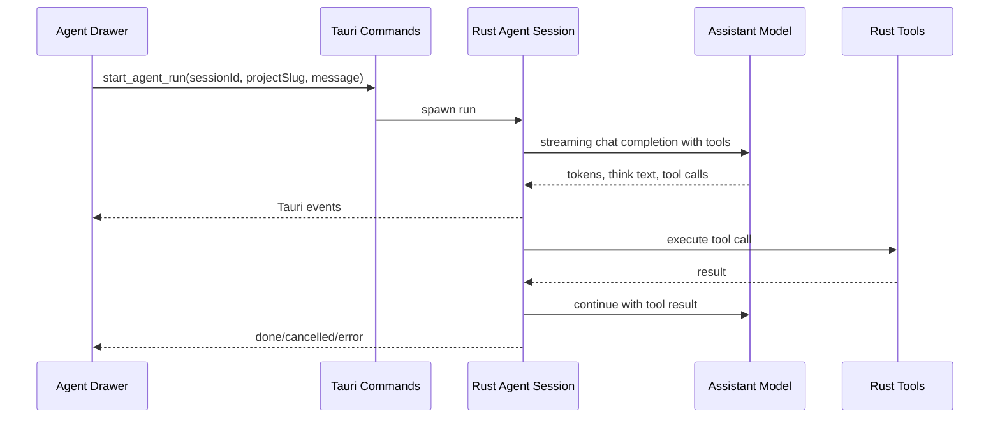

# Task Assistant Drawer Design

## Context

KittyNest is a local-first Tauri desktop app for tracking coding sessions. The requested work optimizes the Tasks surface and adds an Agent chat drawer for task assistance.

The user confirmed that the existing Settings `Assistant model` is the Task model for this feature. The user also approved using Tauri events instead of WebSocket transport.

## Goals

- Remove the Create Task card from the Tasks page.
- Replace the sidebar's bottom Local Ledger card with an Assistant button.
- Open a right-side floating Agent Drawer from the Assistant button.
- Support a Task Assistant chat flow using the Settings Assistant model.
- Implement the required tools in Rust: `read_file`, `ask_user`, `todo_write`, `grep`, and `glob`.
- Stream assistant output through Tauri events.
- Render Thinking, Tool, permission, ask_user, TODO, input, send/stop, and context controls as specified.

## Non-Goals

- Do not add extra tools such as shell execution, file editing, or web fetch.
- Do not add saved assistant sessions.
- Do not add remote browser support.
- Do not create tasks from the Tasks page as part of this drawer work.

## Transport Decision

The Agent Drawer will use Tauri events for downstream streaming and Tauri commands for upstream user actions.

Downstream examples:

- `agent://event` with `{ sessionId, type: "token", delta }`
- `agent://event` with `{ sessionId, type: "thinking_delta", delta }`
- `agent://event` with `{ sessionId, type: "tool_start", toolCallId, name, arguments, summary }`
- `agent://event` with `{ sessionId, type: "tool_output", toolCallId, delta }`
- `agent://event` with `{ sessionId, type: "tool_end", toolCallId, status, resultPreview }`
- `agent://event` with `{ sessionId, type: "todo_update", todos }`
- `agent://event` with `{ sessionId, type: "permission_request", requestId, title, description, options }`
- `agent://event` with `{ sessionId, type: "ask_user_request", requestId, title, questions }`
- `agent://event` with `{ sessionId, type: "done", reply, context }`
- `agent://event` with `{ sessionId, type: "cancelled", context }`
- `agent://event` with `{ sessionId, type: "error", error, context }`

Upstream commands:

- `start_agent_run(session_id, project_slug, message)`
- `stop_agent_run(session_id)`
- `resolve_agent_permission(session_id, request_id, value, supplemental_info)`
- `resolve_agent_ask_user(session_id, request_id, answers)`

This keeps the feature local to the Tauri app, avoids a localhost port, and still provides streaming behavior.

## Frontend Design

The sidebar bottom card becomes an Assistant navigation-style button. The previous Local Ledger and SQLite synced card is removed from the sidebar. The existing footer can continue to show SQLite status.

The Agent Drawer is a fixed panel attached to the right viewport edge, above the workspace, with a resize handle on the left edge. Minimum width is 460px. Width is clamped to the viewport so the main app remains usable.

The drawer contains:

- Header with Agent title, selected mode summary, and close button.
- Scrollable message stream.
- TODO card centered on the top edge of the input area. It is hidden when no TODO items exist, expanded when TODO items first appear, and can collapse to a compact font/icon handle.
- Input area with a round gear button at bottom-left, context ring near bottom-right, and round Send/Stop button at bottom-right.

The gear opens a modal with a task type tab bar. The only tab is `Task Assistant`. This tab requires selecting one Project from `state.projects` where `reviewStatus === "reviewed"`.

Message rendering:

- User messages render as compact user bubbles.
- Assistant messages render full Markdown with `ReactMarkdown` and `remarkGfm`.
- `<think>...</think>` content renders in a Thinking card, collapsed by default to one line and expandable.
- Tool calls and tool results render in one Tool card per `toolCallId`, collapsed by default to one line and expandable.
- `permission_request` and `ask_user_request` render as in-chat cards. Once the user responds, the card is removed.
- Error events render as error messages.

Context ring:

- Smaller than the Send/Stop button.
- Gray ring with progress arc showing used context ratio.
- Hover tooltip shows current context length and System/User/Assistant/Thinking/Tool shares as one decimal percentage.

## Backend Design

Add a Rust assistant runtime with small, focused modules:

- `assistant.rs`: session registry, run lifecycle, cancellation, Tauri event emission.
- `assistant_llm.rs`: OpenAI-compatible streaming request support with tool calls.
- `assistant_tools.rs`: Rust tool schemas and tool execution.
- `assistant_context.rs`: message storage and estimated context accounting.

The runtime resolves model settings with `LlmScenario::Assistant`. If the assistant model is unset, it falls back through existing `resolve_llm_settings` behavior.

The agent loop:

1. Append user message to the session.
2. Build system prompt, conversation history, and tool schemas.
3. Send a streaming OpenAI-compatible chat completion request.
4. Split `<think>` blocks into thinking events and visible assistant token events.
5. If tool calls are returned, append assistant tool-call message, execute tools, append tool results, and loop.
6. If no tool calls are returned, append assistant message and emit `done`.
7. If cancellation is requested, emit `cancelled` and repair any incomplete tool call with a synthetic interrupted result.

Anthropic direct streaming is not part of this implementation. Existing settings support `interface`, but the initial Agent runtime will return a clear error if a non-OpenAI-compatible Assistant model is selected. This avoids overbuilding a second tool-call transport in the first pass.

## Tools

`read_file`

- Parameters: `file_path`, `offset`, `limit`.
- Reads a file with 1-based line numbers.
- Defaults: offset 1, limit 2000.
- Returns errors for missing paths and directories.

`grep`

- Parameters: `pattern`, `path`, `include`.
- Regex search over a file or directory.
- Skips `.git`, `node_modules`, `__pycache__`, `.venv`, `venv`, `.tox`, `dist`, and `build`.
- Returns up to 200 matches.

`glob`

- Parameters: `pattern`, `path`.
- Supports recursive glob patterns.
- Returns newest 100 matches.

`todo_write`

- Parameters: `todos`.
- Requires `content`, `active_form`, and `status`.
- Valid statuses: `pending`, `in_progress`, `completed`.
- Stores unfinished TODO items in the assistant session.
- Emits `todo_update`.

`ask_user`

- Parameters: `questions`.
- Supports one to four questions.
- Each question supports `header`, `question`, `multiSelect`, `allowFreeformInput`, and up to four options.
- Emits `ask_user_request` and blocks until the front end calls `resolve_agent_ask_user`.

## Permissions

File tools are scoped to the selected reviewed Project workdir by default. If a tool request resolves outside that workdir, the backend emits `permission_request` and waits for the user's decision.

Permission options are:

- `Allow`
- `Deny`

If denied, the tool returns a clear denial result to the model. If allowed with supplemental information, the tool result includes the permission note.

## Data Flow

## Testing Plan

Frontend tests:

- Tasks page does not render Create Task controls.
- Assistant button opens the drawer.
- Gear modal lists only reviewed projects.
- Event payloads render assistant tokens, thinking cards, tool cards, TODO cards, permission cards, and ask_user cards.
- Stop button calls `stop_agent_run`.
- Context tooltip renders one-decimal percentages.

Backend tests:

- Think block stream filter handles split tags.
- `todo_write` validates statuses and emits stored TODOs.
- `ask_user` blocks and resumes with normalized answers.
- File tools enforce project workdir scope and request permission for outside paths.
- Agent cancellation emits `cancelled` and repairs incomplete tool calls.
- Assistant model resolution uses `LlmScenario::Assistant`.

Verification commands:

- `npm test`
- `cargo test`

## Success Criteria

- The Tasks page no longer shows the Create Task card.
- The sidebar no longer shows Local Ledger or SQLite synced in the bottom card.
- The Assistant button opens a right-edge drawer with resize support.
- The drawer can select a reviewed Project and send a Task Assistant message.
- Assistant output streams through Tauri events.
- Stop interrupts an active run.
- Thinking, Tool, TODO, permission, ask_user, context ring, and Markdown rendering match the requested behavior.
- `npm test` and `cargo test` pass.
