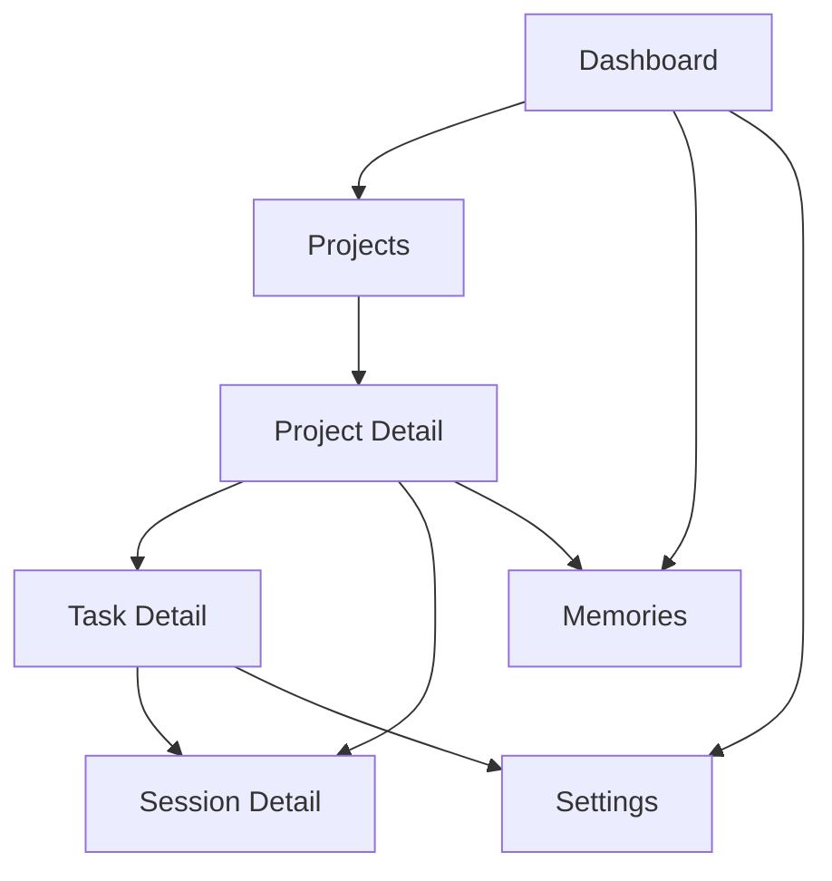

# KittyNest UI 设计图

> 基于 `prompt.md`，日期：2026-04-26

## 1. 设计方向

KittyNest 的 UI 应该像一个 Web3 加密科技风的 macOS 桌面 Agent 工作台，而不是浏览器里的网页看板。核心气质是高密度、发光、可信、可追踪：用户打开桌面应用后能立刻看到项目状态、任务进展、最近 session、记忆是否更新，以及哪些动作需要手动触发。

视觉方向采用“链上控制台 + Tauri 桌面指挥舱”：

- 布局密度中高，优先桌面窗口内的扫描效率和状态可视化。
- 主色使用深空黑、石墨灰、电光青、酸性绿和少量琥珀作为状态提示。
- 卡片采用细线边框、微弱霓虹描边、半透明玻璃质感和区块链节点纹理。
- 窗口保留 macOS 原生信号：圆形窗口控制、标题栏、应用侧边栏、底部运行状态栏。
- 操作按钮保持清晰：Review、Scan、Create Task、Refresh Memory 是主要动作。
- 应用不做大型 hero，启动后直接进入 Dashboard。

## 2. 生成 UI 图

图片文件：`docs/kittynest-ui-concept.png`


## 3. 信息架构



## 4. 首页 Dashboard 线框

```text
+----------------------------------------------------------------------------------+
| macOS titlebar: KittyNest                         LLM Ready   Local Ledger        |
+----------------------------------------------------------------------------------+
| Sidebar        | Project Health                                                   |
| Dashboard      | +----------------------+ +----------------------+ +------------+ |
| Projects       | | Active Projects  08  | | Open Tasks      31   | | Sessions   | |
| Tasks          | | 3 need review        | | 9 in development     | | 14 new     | |
| Memories       | +----------------------+ +----------------------+ +------------+ |
| Settings       |                                                                 |
| +----------------------+ +----------------------+ +----------------------+       |
| | Projects                                  | | Memory Pulse                 |   |
| | KittyCode          review stale   Scan    | | System memory updated 10:42  |   |
| | KittyNest          in progress    Open    | | 4 project memories changed   |   |
| | ResearchBoard      new sessions   Scan    | | Refresh Memory               |   |
| +-------------------------------------------+ +------------------------------+   |
|                                                                                  |
| +-------------------------------------------+ +------------------------------+   |
| | Recent Sessions                           | | Task Status                  |   |
| | session title / project / task / source   | | Discussing  Developing Done  |   |
| | session title / project / task / source   | | compact horizontal chart     |   |
| +-------------------------------------------+ +------------------------------+   |
| Status bar: Tauri commands idle | SQLite synced | ~/.kittynest | AES-256 local   |
+----------------------------------------------------------------------------------+
```

## 5. 项目详情页线框

```text
+----------------------------------------------------------------------------------+
| KittyNest / Projects / KittyNest                                      Settings    |
+----------------------------------------------------------------------------------+
| KittyNest                                                                         |
| Local agent task tracker                                                          |
| [Review Project] [Scan New Sessions] [Import Historical Sessions]                 |
|                                                                                  |
| +-------------------------------+ +--------------------------------------------+ |
| | Project Summary               | | Progress                                   | |
| | tech stack, architecture,     | | latest completed work, active risks,       | |
| | code quality, risk points     | | next likely tasks                          | |
| +-------------------------------+ +--------------------------------------------+ |
|                                                                                  |
| Tasks                                                                            |
| +----------------------+ +----------------------+ +----------------------+       |
| | session-ingest       | | memory-system        | | web-dashboard       |       |
| | Developing           | | Discussing           | | Done                 |       |
| | 12 sessions          | | 4 sessions           | | 7 sessions           |       |
| +----------------------+ +----------------------+ +----------------------+       |
+----------------------------------------------------------------------------------+
```

## 6. 任务详情页线框

```text
+----------------------------------------------------------------------------------+
| KittyNest / KittyNest / session-ingest                                 Settings   |
+----------------------------------------------------------------------------------+
| session-ingest                                                  Status: Developing |
| Brief summary generated from related sessions and user prompts                    |
| [Add Prompt] [Resummarize Task]                                                   |
|                                                                                  |
| +-------------------------------------------+ +-------------------------------+  |
| | User Prompts                              | | Task Memory                   |  |
| | user_prompt_001.md                        | | facts and preferences         |  |
| | user_prompt_002.md                        | | extracted from this task      |  |
| +-------------------------------------------+ +-------------------------------+  |
|                                                                                  |
| Related Sessions                                                                 |
| +----------------------------------------------------------------------------+   |
| | codex session title      source Codex        updated today       Open       |   |
| | claude session title     source Claude Code  updated yesterday   Open       |   |
| +----------------------------------------------------------------------------+   |
+----------------------------------------------------------------------------------+
```

## 7. 设置页线框

```text
+----------------------------------------------------------------------------------+
| KittyNest / Settings                                                              |
+----------------------------------------------------------------------------------+
| LLM Provider                                                                      |
| Provider preset: [OpenRouter v]                                                   |
| Interface:       [openai v]                                                       |
| Base URL:        https://openrouter.ai/api/v1                                     |
| Model:           [user configured model]                                          |
| API Key:         [stored locally / environment variable]                          |
| [Test Connection] [Save Settings]                                                 |
|                                                                                  |
| Session Sources                                                                  |
| Claude Code: ~/.claude                                                            |
| Codex:       ~/.codex                                                             |
| [Rescan Sources]                                                                  |
+----------------------------------------------------------------------------------+
```

## 8. 关键交互

- Dashboard 的 Scan 只扫描新增 session；Import Historical Sessions 才处理存量 session。
- Review Project 必须由用户手动触发，触发前提示会分析项目代码摘要。
- Task 状态切换使用三段控件：讨论中、开发中、已完成。
- 任务创建和追加提示词保留原始输入，不只保留 LLM 摘要。
- 长任务进入 job 状态面板，显示运行中、成功、失败和可重试状态。

## 9. 桌面窗口规则

- 主目标是 macOS 桌面窗口，不按手机优先设计。
- 默认窗口建议为 `1440 x 960`，最小窗口建议为 `1180 x 760`。
- 左侧固定应用导航，顶部保留 macOS/Tauri 标题栏，底部显示本地运行状态。
- 主内容区使用两列：左侧项目/session 工作区，右侧记忆、任务状态和 job 状态。
- 缩小窗口时隐藏非关键图表细节，但保留 Review、Scan、Create Task、Settings 等核心入口。

## 10. 生图提示词

```text
Use case: ui-mockup
Asset type: macOS desktop app UI concept image for documentation
Primary request: Create a polished macOS desktop application UI mockup for KittyNest, a local-first Tauri desktop app for tracking Claude Code and Codex agent sessions.
Subject: A desktop dashboard showing project tracking, task status, recent sessions, memory updates, Tauri command/job status, local encrypted ledger status, and LLM settings access.
Style/medium: high-fidelity macOS desktop product UI mockup, direct app-window screenshot, Web3 crypto technology dashboard, cyber terminal, refined neon glassmorphism, credible enterprise-grade desktop interface.
Composition/framing: 16:9 desktop image, direct front view, no perspective tilt, a single macOS app window visible with subtle desktop shadow and rounded app frame.
Layout: macOS titlebar with red/yellow/green window controls and KittyNest title; left desktop sidebar navigation; main dashboard with metric tiles, project list, recent sessions table, task status panel, memory pulse panel, Tauri job/status bar, subtle blockchain node network background, and clear action buttons for Review Project, Scan Sessions, Create Task.
Color palette: deep space black, graphite, electric cyan, acid green, amber warning accents, faint magenta edge light only as a secondary accent; avoid light paper theme and avoid pure purple gradient aesthetic.
Visual details: glowing data rails, fine grid lines, node-link patterns, glass panels, token-like status chips, luminous chart strokes, precise cyber typography, macOS-native window chrome, local-first security badges, command queue indicators.
Text constraints: Use only a few large readable labels: KittyNest, Dashboard, Projects, Tasks, Sessions, Memory, Settings, Review, Scan, Local Mode, Tauri Jobs. Other text can be abstract UI lines.
Constraints: no marketing hero, no stock photos, no phone mockup, no browser address bar, no code editor, no wallet trading screen, no token price chart focus, no watermark.
Avoid: blurry text, tiny unreadable labels, generic SaaS dashboard, light off-white theme, dark blue monochrome palette, purple gradient-only aesthetic, nested card clutter, web browser frame.
```
